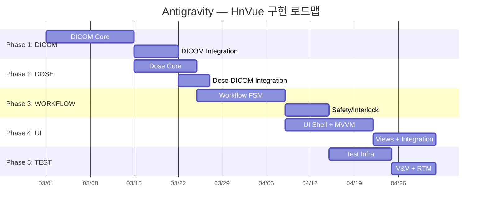

# Antigravity — HnVue Console 잔여 SPEC 구현 마스터 플랜

> **문서 ID**: antigravity-plan-001  
> **작성일**: 2026-02-27  
> **프로젝트**: HnVue — 진단 의료용 X-ray GUI Console SW  
> **범위**: 5개 미완료 SPEC (DICOM → DOSE → WORKFLOW → UI → TEST)

---

## Executive Summary

현재 HnVue 프로젝트는 9개 SPEC 중 4개(INFRA, IPC, HAL, IMAGING)가 완료되어 **44% 진행** 상태입니다. 이 플랜은 나머지 5개 SPEC의 구현 순서, 태스크 분해, 의존성, 리스크를 정의합니다.

---

## Phase 1: SPEC-DICOM-001 — DICOM Communication Services

> **Safety Class**: IEC 62304 Class B | **Library**: fo-dicom 5.x | **Package**: `src/HnVue.Dicom/`

### 체크리스트

- [ ] **D-01**: `AssociationManager` — 연결 풀링, A-ASSOCIATE 협상, 수명주기 관리
- [ ] **D-02**: `StorageScu` — C-STORE (DX/CR), Transfer Syntax 협상/트랜스코딩
- [ ] **D-03**: `WorklistScu` — Modality Worklist C-FIND SCU
- [ ] **D-04**: `MppsScu` — MPPS N-CREATE / N-SET
- [ ] **D-05**: `StorageCommitScu` — Storage Commitment N-ACTION / N-EVENT-REPORT
- [ ] **D-06**: `TransmissionQueue` — 영구 재전송 큐 (exponential backoff)
- [ ] **D-07**: `DxImage` / `CrImage` IOD builder — DICOM 필수 속성 매핑
- [ ] **D-08**: `RdsrBuilder` — X-Ray Radiation Dose SR 빌더 (DOSE 모듈 연동점)
- [ ] **D-09**: `DicomTlsFactory` — TLS 1.2/1.3, 인증서 관리
- [ ] **D-10**: `UidGenerator` 보강 — 조직 UID root 설정형 생성기 _(일부 존재)_
- [ ] **D-11**: `DicomServiceOptions` 보강 — IOptions<T> 설정 모델 _(일부 존재)_
- [ ] **D-12**: `DicomServiceFacade` — 단일 진입점 패사드
- [ ] **D-13**: `QueryRetrieveScu` — (Optional) Prior Study C-FIND / C-MOVE
- [ ] **D-14**: `PrintScu` — (Optional) Basic Grayscale Print
- [ ] **D-15**: DICOM Conformance Statement 문서 초안
- [ ] **D-16**: Unit Test (xUnit) — 최소 85% coverage
- [ ] **D-17**: Integration Test — Orthanc Docker 기반 C-STORE/C-FIND 검증

### 기존 코드 현황

| 파일                                                 |    상태     | 비고      |
| ---------------------------------------------------- | :---------: | --------- |
| `Associations/AssociationManager.cs`                 | 🟡 스켈레톤 | 확장 필요 |
| `Uid/UidGenerator.cs`                                | 🟡 스켈레톤 | 확장 필요 |
| `Configuration/DicomServiceOptions.cs`               | 🟡 스켈레톤 | 확장 필요 |
| `DependencyInjection/ServiceCollectionExtensions.cs` | 🟡 스켈레톤 | 확장 필요 |

### 핵심 결정 사항

> [!IMPORTANT]
> **OQ-01**: 조직 DICOM UID root 확정 필요 (UID 생성 전)  
> **OQ-02**: Storage Commitment 동기/비동기 방식 확정 필요

---

## Phase 2: SPEC-DOSE-001 — Radiation Dose Management

> **Safety Class**: IEC 62304 Class B | **Package**: `src/HnVue.Dose/`

### 체크리스트

- [ ] **DO-01**: `DapCalculator` — DAP 계산 엔진 (K_air × A_field)
- [ ] **DO-02**: `CalibrationManager` — 보정 계수 관리 (변조 방지)
- [ ] **DO-03**: `DoseModelParameters` — HVG 튜브 모델 파라미터
- [ ] **DO-04**: `ExposureParameterReceiver` — HVG 파라미터 수신
- [ ] **DO-05**: `DapMeterInterface` — 외장 DAP 미터 어댑터 (Optional)
- [ ] **DO-06**: `DetectorGeometryProvider` — 필드 면적/SID 데이터
- [ ] **DO-07**: `DoseRecord` + `DoseRecordRepository` — 원자적 영구 저장
- [ ] **DO-08**: `StudyDoseAccumulator` — 검사별 누적 선량
- [ ] **DO-09**: `AuditTrailWriter` — SHA-256 해시체인 감사 추적
- [ ] **DO-10**: `RdsrBuilder` + `RdsrTemplateMapper` — TID 10001/10003 매핑
- [ ] **DO-11**: `RdsrExporter` — DICOM C-STORE 연동 (SPEC-DICOM-001 활용)
- [ ] **DO-12**: `DrlConfiguration` + `DrlComparer` — DRL 비교/알림
- [ ] **DO-13**: `DoseDisplayNotifier` — GUI 알림 (IObservable)
- [ ] **DO-14**: `DoseReportGenerator` — PDF 보고서 생성
- [ ] **DO-15**: Unit Test — 최소 90% coverage (Class B 강화)
- [ ] **DO-16**: 정확도 검증 — ±5% 이내 (NFR-DOSE-03)

### 핵심 리스크

> [!WARNING]
> **RDSR-DICOM 통합 갭**: DOSE의 RDSR과 DICOM의 C-STORE 간 인터페이스 명세 부재  
> → Phase 1 D-08과 Phase 2 DO-10/DO-11을 공동 설계해야 함

---

## Phase 3: SPEC-WORKFLOW-001 — Clinical Workflow Engine

> **Safety Class**: IEC 62304 Class C ⚠️ | **Package**: `src/HnVue.Workflow/`

### 체크리스트

#### 3A. State Machine Core

- [ ] **WF-01**: `WorkflowStateMachine` — 10-state FSM 오케스트레이터
- [ ] **WF-02**: `WorkflowState` enum + `WorkflowTransition` 레코드
- [ ] **WF-03**: `TransitionGuardMatrix` — 19개 전이 가드 평가 엔진
- [ ] **WF-04**: `TransitionResult` — 성공/실패 결과 타입

#### 3B. State Handlers (10개)

- [ ] **WF-05**: `IdleStateHandler`
- [ ] **WF-06**: `WorklistSyncStateHandler`
- [ ] **WF-07**: `PatientSelectStateHandler`
- [ ] **WF-08**: `ProtocolSelectStateHandler`
- [ ] **WF-09**: `PositionAndPreviewStateHandler`
- [ ] **WF-10**: `ExposureTriggerStateHandler` ⚠️ Class C
- [ ] **WF-11**: `QcReviewStateHandler`
- [ ] **WF-12**: `MppsCompleteStateHandler`
- [ ] **WF-13**: `PacsExportStateHandler`
- [ ] **WF-14**: `RejectRetakeStateHandler`

#### 3C. Safety & Protocol

- [ ] **WF-15**: `InterlockChecker` — 9개 HW 인터록 체인 검증 ⚠️ Class C
- [ ] **WF-16**: `ParameterSafetyValidator` — kVp/mA/mAs/DAP 안전 한계 ⚠️ Class C
- [ ] **WF-17**: `DeviceSafetyLimits` — 장치 안전 한계 설정
- [ ] **WF-18**: `ProtocolRepository` + `ProtocolValidator` — SQLite 기반
- [ ] **WF-19**: `ProcedureCodeMapper` — Worklist 코드→프로토콜 매핑

#### 3D. Journal & Recovery

- [ ] **WF-20**: `SqliteWorkflowJournal` — 영구 저널 (WAL 패턴)
- [ ] **WF-21**: `CrashRecoveryService` — 시작 시 저널 리플레이
- [ ] **WF-22**: `StudyContext` + `ExposureRecord` — 데이터 모델

#### 3E. Integration

- [ ] **WF-23**: `DoseTrackingCoordinator` — DOSE 연동
- [ ] **WF-24**: Workflow IPC 이벤트 — `WorkflowStateChangedEvent` 등

#### 3F. Testing ⚠️

- [ ] **WF-25**: Unit Test — **100% decision coverage** (Class C 필수)
- [ ] **WF-26**: Safety interlock 전수 테스트 (IL-01~IL-09)
- [ ] **WF-27**: Guard failure recovery 테스트

> [!CAUTION]
> **Class C 컴포넌트** (ExposureTriggerStateHandler, InterlockChecker, ParameterSafetyValidator)는  
> IEC 62304에 의해 **100% decision coverage**가 법적 필수입니다.  
> Safety/ 네임스페이스 내 모든 코드가 이에 해당합니다.

---

## Phase 4: SPEC-UI-001 — WPF Console UI

> **Safety Class**: IEC 62304 Class B | **Package**: `src/HnVue.Console/`

### 체크리스트

#### 4A. Shell & Infrastructure

- [ ] **UI-01**: WPF Shell (MainWindow + Navigation + StatusBar)
- [ ] **UI-02**: DI 컨테이너 설정 (Microsoft.Extensions.DependencyInjection)
- [ ] **UI-03**: gRPC Service interfaces (`IPatientService`, `IWorklistService` 등 9개)
- [ ] **UI-04**: Localization 인프라 (.resx — ko-KR, en-US)
- [ ] **UI-05**: 디자인 시스템 (Colors, Typography, Spacing, Theme)

#### 4B. Primary Views (7개)

- [ ] **UI-06**: `PatientView` + `PatientViewModel` — 환자 검색/등록/편집
- [ ] **UI-07**: `WorklistView` + `WorklistViewModel` — MWL 표시/선택
- [ ] **UI-08**: `AcquisitionView` + `AcquisitionViewModel` — 실시간 프리뷰, 프로토콜, 노출, AEC, Dose
- [ ] **UI-09**: `ImageReviewView` + `ImageReviewViewModel` — W/L, Zoom, Pan, Rotate, Flip, 측정 도구
- [ ] **UI-10**: `SystemStatusView` + `SystemStatusViewModel` — 시스템 상태 대시보드
- [ ] **UI-11**: `ConfigurationView` + `ConfigurationViewModel` — 설정
- [ ] **UI-12**: `AuditLogView` + `AuditLogViewModel` — 감사 로그

#### 4C. Image Viewer Core

- [ ] **UI-13**: 16-bit grayscale 렌더러 (WriteableBitmap Gray16)
- [ ] **UI-14**: W/L 조정 (DICOM PS 3.14 GSDF)
- [ ] **UI-15**: 측정 도구 (거리, 각도, Cobb angle, Annotation)

#### 4D. Testing

- [ ] **UI-16**: ViewModel Unit Test — 최소 85% coverage (xUnit + Moq)
- [ ] **UI-17**: MVVM 준수 검증 — ViewModel에 System.Windows 참조 없음

---

## Phase 5: SPEC-TEST-001 — Testing Framework & V&V

> **Package**: `tests/` 전체

### 체크리스트

#### 5A. Test Infrastructure

- [ ] **T-01**: `tests/` 디렉토리 구조 재편 (SPEC 4.1 기준)
- [ ] **T-02**: Docker Compose — Orthanc PACS + DVTK 환경
- [ ] **T-03**: CI Pipeline 확장 — Unit → Integration → DICOM → System → Coverage Gate

#### 5B. HW Simulator Testbench

- [ ] **T-04**: Python Detector Simulator (USB 프로토콜 에뮬레이션)
- [ ] **T-05**: Python Generator Simulator (Serial 프로토콜 에뮬레이션)
- [ ] **T-06**: Fault Injection 인터페이스

#### 5C. DICOM Conformance

- [ ] **T-07**: DVTK 기반 IOD 검증 스크립트
- [ ] **T-08**: Orthanc 기반 C-STORE/C-FIND 통합 테스트
- [ ] **T-09**: 합성 DICOM 테스트 데이터 생성기

#### 5D. V&V Documentation

- [ ] **T-10**: Requirements Traceability Matrix (RTM) — CSV/HTML
- [ ] **T-11**: IEC 62304 §5.5~5.8 검증 증거 문서
- [ ] **T-12**: DICOM Conformance Statement 최종본
- [ ] **T-13**: Coverage 리포트 집계 (Cobertura XML)

#### 5E. System Tests

- [ ] **T-14**: End-to-end 워크플로우 테스트 (환자 등록 → 촬영 → PACS 전송)
- [ ] **T-15**: Interoperability 테스트 (다중 PACS 벤더)
- [ ] **T-16**: Usability 테스트 계획서 (IEC 62366)

---

## Cross-Phase 의존성 매트릭스

| → 의존됨     | DICOM |    DOSE     |        WORKFLOW        |     UI      |       TEST       |
| :----------- | :---: | :---------: | :--------------------: | :---------: | :--------------: |
| **DICOM**    |   —   | RDSR Export | Worklist/MPPS/C-STORE  | gRPC proxy  |    DVTK 검증     |
| **DOSE**     |   —   |      —      | DoseTracker 인터페이스 | 표시값 전달 |   정확도 검증    |
| **WORKFLOW** |   —   |      —      |           —            | 상태 이벤트 |   Safety 검증    |
| **UI**       |   —   |      —      |           —            |      —      | ViewModel 테스트 |
| **TEST**     |   —   |      —      |           —            |      —      |        —         |

---

## Verification Plan

### 자동화 테스트

| 대상          | 프레임워크    | 실행 방법                                             | 커버리지 목표  |
| ------------- | ------------- | ----------------------------------------------------- | :------------: |
| DICOM 모듈    | xUnit         | `dotnet test tests/HnVue.Dicom.Tests/`                |      85%       |
| DOSE 모듈     | xUnit         | `dotnet test tests/HnVue.Dose.Tests/` (신규 생성)     |      90%       |
| WORKFLOW 모듈 | xUnit         | `dotnet test tests/HnVue.Workflow.Tests/` (신규 생성) | 100% (Class C) |
| UI ViewModel  | xUnit         | `dotnet test tests/HnVue.Console.Tests/` (신규 생성)  |      85%       |
| DICOM 적합성  | DVTK + pytest | `docker compose up orthanc && pytest tests/dicom/`    |   Pass/Fail    |
| 통합 테스트   | pytest        | `pytest tests/integration/`                           |       —        |

### 기존 테스트 확인

| 경로                            | 내용                                            |  상태   |
| ------------------------------- | ----------------------------------------------- | :-----: |
| `tests/HnVue.Dicom.Tests/`      | `DicomServiceOptionsTests`, `UidGeneratorTests` | ✅ 존재 |
| `tests/HnVue.Ipc.Client.Tests/` | IPC Client 10개 테스트                          | ✅ 존재 |
| `tests/cpp/`                    | C++ HAL/Imaging/IPC/Infra 테스트                | ✅ 존재 |
| `tests/csharp/`                 | C# DICOM 테스트                                 | ✅ 존재 |
| `tests/docker/`                 | Docker 설정 1건                                 | ✅ 존재 |

### 수동 검증

각 Phase 완료 시 아래 항목을 수동 확인:

1. **DICOM**: Orthanc 웹 UI에서 C-STORE 전송된 이미지 확인 (`localhost:8042`)
2. **DOSE**: 정확도 벤치마크 — 기준 팬텀 데이터 대비 ±5% 이내
3. **WORKFLOW**: Safety interlock 시나리오 19개 전이 매트릭스 전수 검증
4. **UI**: 1920×1080 해상도에서 전체 뷰 레이아웃 확인, 한국어 로캘 검증

---

## User Review Required

> [!IMPORTANT]
> 아래 사항에 대한 확인이 필요합니다:
>
> 1. **구현 순서**: DICOM → DOSE → WORKFLOW → UI → TEST 순서가 적절한가요?  
>    (DOSE는 DICOM의 C-STORE에 의존하고, WORKFLOW는 전체에 의존)
> 2. **Optional 기능**: Query/Retrieve (D-13), Print (D-14), Multi-Monitor (UI FR-14)를 이번 라운드에 포함할까요?
> 3. **Phase 3 WORKFLOW**의 Class C 범위가 Safety/ 네임스페이스로 한정되어 있는데, 추가 범위가 있나요?
