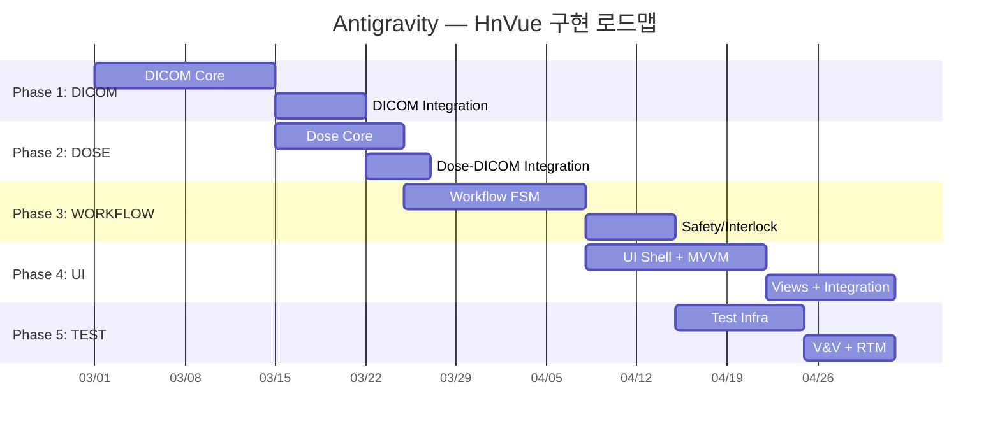

# Antigravity — HnVue Console 잔여 SPEC 구현 마스터 플랜

> **문서 ID**: antigravity-plan-001  
> **작성일**: 2026-02-27  
> **최종 업데이트**: 2026-02-27 21:17 KST (구현 현황 반영)  
> **프로젝트**: HnVue — 진단 의료용 X-ray GUI Console SW  
> **범위**: 5개 미완료 SPEC (DICOM → DOSE → WORKFLOW → UI → TEST)

---

## Executive Summary

9개 SPEC 중 4개(INFRA, IPC, HAL, IMAGING)가 완료되어 **44% 진행** 상태입니다.
나머지 5개 SPEC의 구현 순서, 태스크 분해, 의존성, 리스크를 정의합니다.

### 현재 코드베이스 규모

| 영역                                    | 파일 수 |   LOC   | 비고                               |
| --------------------------------------- | :-----: | :-----: | ---------------------------------- |
| C++ Core (`libs/`)                      |   62    | ~15,983 | HAL, Imaging, IPC, Infra           |
| C# DICOM (`src/HnVue.Dicom/`)           |    4    |   806   | AssociationMgr, UidGen, Config, DI |
| C# IPC Client (`src/HnVue.Ipc.Client/`) |    8    | ~1,584  | 완료                               |
| C++ Tests (`tests/cpp/`)                |   15    | ~4,200  | HAL, Imaging, IPC                  |
| C# Tests (DICOM)                        |    2    |   434   | 28개 테스트 메서드                 |
| C# Tests (IPC Client)                   |   11    | ~3,200  | 완료                               |
| C# Integration Tests                    |    3    |  ~600   | IPC 라운드트립                     |
| Docker                                  |    1    |   28    | Orthanc compose                    |
| Python Tests                            |    0    |    0    | 미구현                             |

### 상태 범례

| 아이콘 | 의미                  |
| :----: | --------------------- |
|   ✅   | 구현 완료             |
|   🟡   | 부분 구현 (확장 필요) |
|   ⬜   | 미구현                |

---

## Phase 1: SPEC-DICOM-001 — DICOM Communication Services

> **Safety Class**: IEC 62304 Class B | **Library**: fo-dicom 5.x | **Package**: `src/HnVue.Dicom/`  
> **SPEC 문서**: `spec.md` ✅ | `plan.md` ✅ | `acceptance.md` ✅

### 기존 구현 상태 (806 LOC + 434 LOC 테스트)

| 파일                                                 | LOC |    상태     | 구현 내용                                                                 |
| ---------------------------------------------------- | :-: | :---------: | ------------------------------------------------------------------------- |
| `Associations/AssociationManager.cs`                 | 321 | ✅ **완료** | A-ASSOCIATE 협상, 연결 풀링, TLS 설정, 세마포어 기반 동시성, Dispose 패턴 |
| `Uid/UidGenerator.cs`                                | 153 | ✅ **완료** | Study/Series/SOP/MPPS UID 생성, 스레드 안전, 유효성 검증, 64자 제한       |
| `Configuration/DicomServiceOptions.cs`               | 265 | ✅ **완료** | 6개 설정 모델 (Options, Pool, Retry, TLS, Timeout, Destination)           |
| `DependencyInjection/ServiceCollectionExtensions.cs` | 71  |   🟡 부분   | IOptions 바인딩 + UidGen/AssocMgr 등록 완료, SCU 서비스 주석 처리         |
| `Tests/Configuration/DicomServiceOptionsTests.cs`    | 143 | ✅ **완료** | 9개 테스트 메서드                                                         |
| `Tests/Uid/UidGeneratorTests.cs`                     | 293 | ✅ **완료** | 19개 테스트 메서드 (멀티스레드 포함)                                      |

### 체크리스트

- ✅ **D-01**: `AssociationManager` — 연결 풀링, A-ASSOCIATE 협상, TLS, 수명주기 관리
- ⬜ **D-02**: `StorageScu` — C-STORE (DX/CR), Transfer Syntax 협상/트랜스코딩
- ⬜ **D-03**: `WorklistScu` — Modality Worklist C-FIND SCU
- ⬜ **D-04**: `MppsScu` — MPPS N-CREATE / N-SET
- ⬜ **D-05**: `StorageCommitScu` — Storage Commitment N-ACTION / N-EVENT-REPORT
- ⬜ **D-06**: `TransmissionQueue` — 영구 재전송 큐 (exponential backoff)
- ⬜ **D-07**: `DxImage` / `CrImage` IOD builder — DICOM 필수 속성 매핑
- ⬜ **D-08**: `RdsrBuilder` — X-Ray Radiation Dose SR 빌더 (DOSE 모듈 연동점)
- 🟡 **D-09**: `DicomTlsFactory` — TLS 설정 로직 `AssociationManager.ConfigureTls()`에 내장, 별도 팩토리 분리 필요
- ✅ **D-10**: `UidGenerator` — 조직 UID root 설정형 생성기 (완료)
- ✅ **D-11**: `DicomServiceOptions` — IOptions\<T\> 설정 모델 (완료, 6개 하위 모델 포함)
- ⬜ **D-12**: `DicomServiceFacade` — 단일 진입점 패사드
- ⬜ **D-13**: `QueryRetrieveScu` — (Optional) Prior Study C-FIND / C-MOVE
- ⬜ **D-14**: `PrintScu` — (Optional) Basic Grayscale Print
- ⬜ **D-15**: DICOM Conformance Statement 문서 초안
- 🟡 **D-16**: Unit Test — 28개 테스트 완료 (Options 9 + UidGen 19), SCU 테스트 미작성
- ⬜ **D-17**: Integration Test — Orthanc Docker 기반 C-STORE/C-FIND 검증 (compose 파일만 존재)

### 진행률: **5/17 완료** (29%)

> [!IMPORTANT]
> **OQ-01**: 조직 DICOM UID root 확정 필요 (현재 `2.25` 테스트용 사용)  
> **OQ-02**: Storage Commitment 동기/비동기 방식 확정 필요

---

## Phase 2: SPEC-DOSE-001 — Radiation Dose Management

> **Safety Class**: IEC 62304 Class B | **Package**: `src/HnVue.Dose/` (신규 생성)  
> **SPEC 문서**: `spec.md` ✅ | `plan.md` ⬜ 미작성 | `acceptance.md` ⬜ 미작성

### 기존 구현 상태

| 항목                            |       상태        | 비고                                                 |
| ------------------------------- | :---------------: | ---------------------------------------------------- |
| `src/HnVue.Dose/` 프로젝트      |     ⬜ 미존재     | 신규 .NET 프로젝트 생성 필요                         |
| HAL `IDoseMonitor.h` 인터페이스 | ✅ 완료 (105 LOC) | `GetCurrentDose()`, `GetDap()`, `Reset()`, 콜백 등록 |
| HAL `MockDoseMonitor.h`         |      ✅ 완료      | 테스트용 모의 객체                                   |

### 체크리스트

- ⬜ **DO-01**: `DapCalculator` — DAP 계산 엔진 (K_air × A_field)
- ⬜ **DO-02**: `CalibrationManager` — 보정 계수 관리 (변조 방지)
- ⬜ **DO-03**: `DoseModelParameters` — HVG 튜브 모델 파라미터
- ⬜ **DO-04**: `ExposureParameterReceiver` — HVG 파라미터 수신 (HAL `IDoseMonitor` 활용)
- ⬜ **DO-05**: `DapMeterInterface` — 외장 DAP 미터 어댑터 (Optional)
- ⬜ **DO-06**: `DetectorGeometryProvider` — 필드 면적/SID 데이터
- ⬜ **DO-07**: `DoseRecord` + `DoseRecordRepository` — 원자적 영구 저장
- ⬜ **DO-08**: `StudyDoseAccumulator` — 검사별 누적 선량
- ⬜ **DO-09**: `AuditTrailWriter` — SHA-256 해시체인 감사 추적
- ⬜ **DO-10**: `RdsrBuilder` + `RdsrTemplateMapper` — TID 10001/10003 매핑
- ⬜ **DO-11**: `RdsrExporter` — DICOM C-STORE 연동 (Phase 1 D-02/D-08 필요)
- ⬜ **DO-12**: `DrlConfiguration` + `DrlComparer` — DRL 비교/알림
- ⬜ **DO-13**: `DoseDisplayNotifier` — GUI 알림 (IObservable)
- ⬜ **DO-14**: `DoseReportGenerator` — PDF 보고서 생성
- ⬜ **DO-15**: Unit Test — 최소 90% coverage (Class B 강화)
- ⬜ **DO-16**: 정확도 검증 — ±5% 이내 (NFR-DOSE-03)

### 진행률: **0/16** (0%)

> [!WARNING]
> **RDSR-DICOM 통합 갭**: DOSE의 RDSR과 DICOM의 C-STORE 간 인터페이스 명세 부재  
> → Phase 1 D-08과 Phase 2 DO-10/DO-11을 공동 설계해야 함

> [!NOTE]
> **선행 자산**: HAL `IDoseMonitor` 인터페이스(105 LOC)와 `MockDoseMonitor`가 이미 구현되어 있어  
> DO-04 파라미터 수신 구현 시 활용 가능

---

## Phase 3: SPEC-WORKFLOW-001 — Clinical Workflow Engine

> **Safety Class**: IEC 62304 Class C ⚠️ | **Package**: `src/HnVue.Workflow/` (신규 생성)  
> **SPEC 문서**: `spec.md` ✅ | `plan.md` ✅ | `acceptance.md` ✅

### 기존 구현 상태

| 항목                           |       상태        | 비고                                                                   |
| ------------------------------ | :---------------: | ---------------------------------------------------------------------- |
| `src/HnVue.Workflow/` 프로젝트 |     ⬜ 미존재     | 신규 .NET 프로젝트 생성 필요                                           |
| HAL `ISafetyInterlock.h`       | ✅ 완료 (163 LOC) | 9개 인터록 (IL-01~IL-09), `CheckAllInterlocks()`, `EmergencyStandby()` |
| HAL `MockSafetyInterlock.h`    |      ✅ 완료      | GMock 기반 모의 객체                                                   |
| HAL `IGenerator.h`             |      ✅ 완료      | Generator 인터페이스 (Arm, Fire, Disarm)                               |
| HAL `MockGenerator.h`          |      ✅ 완료      | 모의 객체                                                              |
| HAL `IAEC.h`                   |      ✅ 완료      | AEC 인터페이스                                                         |
| HAL `GeneratorSimulator`       |      ✅ 완료      | HVG 시뮬레이터                                                         |
| DICOM `plan.md`                |      ✅ 존재      | WORKFLOW plan.md에서 DICOM 의존성 명시                                 |

### 체크리스트

#### 3A. State Machine Core

- ⬜ **WF-01**: `WorkflowStateMachine` — 10-state FSM 오케스트레이터
- ⬜ **WF-02**: `WorkflowState` enum + `WorkflowTransition` 레코드
- ⬜ **WF-03**: `TransitionGuardMatrix` — 19개 전이 가드 평가 엔진
- ⬜ **WF-04**: `TransitionResult` — 성공/실패 결과 타입

#### 3B. State Handlers (10개)

- ⬜ **WF-05**: `IdleStateHandler`
- ⬜ **WF-06**: `WorklistSyncStateHandler`
- ⬜ **WF-07**: `PatientSelectStateHandler`
- ⬜ **WF-08**: `ProtocolSelectStateHandler`
- ⬜ **WF-09**: `PositionAndPreviewStateHandler`
- ⬜ **WF-10**: `ExposureTriggerStateHandler` ⚠️ Class C
- ⬜ **WF-11**: `QcReviewStateHandler`
- ⬜ **WF-12**: `MppsCompleteStateHandler`
- ⬜ **WF-13**: `PacsExportStateHandler`
- ⬜ **WF-14**: `RejectRetakeStateHandler`

#### 3C. Safety & Protocol

- ⬜ **WF-15**: `InterlockChecker` — 9개 HW 인터록 체인 검증 ⚠️ Class C
- ⬜ **WF-16**: `ParameterSafetyValidator` — kVp/mA/mAs/DAP 안전 한계 ⚠️ Class C
- ⬜ **WF-17**: `DeviceSafetyLimits` — 장치 안전 한계 설정
- ⬜ **WF-18**: `ProtocolRepository` + `ProtocolValidator` — SQLite 기반
- ⬜ **WF-19**: `ProcedureCodeMapper` — Worklist 코드→프로토콜 매핑

#### 3D. Journal & Recovery

- ⬜ **WF-20**: `SqliteWorkflowJournal` — 영구 저널 (WAL 패턴)
- ⬜ **WF-21**: `CrashRecoveryService` — 시작 시 저널 리플레이
- ⬜ **WF-22**: `StudyContext` + `ExposureRecord` — 데이터 모델

#### 3E. Integration

- ⬜ **WF-23**: `DoseTrackingCoordinator` — DOSE 연동
- ⬜ **WF-24**: Workflow IPC 이벤트 — `WorkflowStateChangedEvent` 등

#### 3F. Testing ⚠️

- ⬜ **WF-25**: Unit Test — **100% decision coverage** (Class C 필수)
- ⬜ **WF-26**: Safety interlock 전수 테스트 (IL-01~IL-09)
- ⬜ **WF-27**: Guard failure recovery 테스트

### 진행률: **0/27** (0%)

> [!CAUTION]
> **Class C 컴포넌트** (ExposureTriggerStateHandler, InterlockChecker, ParameterSafetyValidator)는  
> IEC 62304에 의해 **100% decision coverage**가 법적 필수입니다.

> [!NOTE]
> **선행 자산**: HAL 계층에 `ISafetyInterlock` (9개 인터록 완전 정의), `IGenerator` (Arm/Fire/Disarm),  
> `IAEC`, `GeneratorSimulator`, 그리고 7개의 Mock 클래스가 모두 준비되어 있어 WF-15/WF-16 구현 즉시 가능

---

## Phase 4: SPEC-UI-001 — WPF Console UI

> **Safety Class**: IEC 62304 Class B | **Package**: `src/HnVue.Console/` (신규 생성)  
> **SPEC 문서**: `spec.md` ✅ | `plan.md` ⬜ 미작성 | `acceptance.md` ⬜ 미작성

### 기존 구현 상태

| 항목                                 |             상태             | 비고                                             |
| ------------------------------------ | :--------------------------: | ------------------------------------------------ |
| `src/HnVue.Console/` 프로젝트        |          ⬜ 미존재           | WPF 프로젝트 신규 생성 필요                      |
| IPC Client (`src/HnVue.Ipc.Client/`) | ✅ 완료 (8파일, ~1,584 LOC)  | gRPC 5채널 (Command, Config, Health, Image, IPC) |
| IPC Client Tests                     | ✅ 완료 (11파일, ~3,200 LOC) | 모든 채널 테스트 + 통합 테스트                   |

### 체크리스트

#### 4A. Shell & Infrastructure

- ⬜ **UI-01**: WPF Shell (MainWindow + Navigation + StatusBar)
- ⬜ **UI-02**: DI 컨테이너 설정 (Microsoft.Extensions.DependencyInjection)
- ⬜ **UI-03**: gRPC Service interfaces 9개 (`IPatientService`, `IWorklistService` 등)
- ⬜ **UI-04**: Localization 인프라 (.resx — ko-KR, en-US)
- ⬜ **UI-05**: 디자인 시스템 (Colors, Typography, Spacing, Theme)

#### 4B. Primary Views (7개)

- ⬜ **UI-06**: `PatientView` + `PatientViewModel` — 환자 검색/등록/편집
- ⬜ **UI-07**: `WorklistView` + `WorklistViewModel` — MWL 표시/선택
- ⬜ **UI-08**: `AcquisitionView` + `AcquisitionViewModel` — 실시간 프리뷰, 프로토콜, 노출, AEC, Dose
- ⬜ **UI-09**: `ImageReviewView` + `ImageReviewViewModel` — W/L, Zoom, Pan, Rotate, Flip, 측정 도구
- ⬜ **UI-10**: `SystemStatusView` + `SystemStatusViewModel` — 시스템 상태 대시보드
- ⬜ **UI-11**: `ConfigurationView` + `ConfigurationViewModel` — 설정
- ⬜ **UI-12**: `AuditLogView` + `AuditLogViewModel` — 감사 로그

#### 4C. Image Viewer Core

- ⬜ **UI-13**: 16-bit grayscale 렌더러 (WriteableBitmap Gray16)
- ⬜ **UI-14**: W/L 조정 (DICOM PS 3.14 GSDF)
- ⬜ **UI-15**: 측정 도구 (거리, 각도, Cobb angle, Annotation)

#### 4D. Testing

- ⬜ **UI-16**: ViewModel Unit Test — 최소 85% coverage (xUnit + Moq)
- ⬜ **UI-17**: MVVM 준수 검증 — ViewModel에 System.Windows 참조 없음

### 진행률: **0/17** (0%)

> [!NOTE]
> **선행 자산**: `HnVue.Ipc.Client` (8파일, ~1,584 LOC)가 완료되어 있어  
> UI에서 C++ Core와의 gRPC 통신 즉시 사용 가능 (Command, Config, Health, Image, IPC 5채널)

---

## Phase 5: SPEC-TEST-001 — Testing Framework & V&V

> **Package**: `tests/` 전체  
> **SPEC 문서**: `spec.md` ✅ | `plan.md` ⬜ 미작성 | `acceptance.md` ⬜ 미작성

### 기존 인프라 현황

| 항목                                           |         상태          | 비고                                     |
| ---------------------------------------------- | :-------------------: | ---------------------------------------- |
| C++ Tests (`tests/cpp/`)                       | ✅ 15파일, ~4,200 LOC | HAL 10 + Imaging 8 + IPC 5 + Infra 1     |
| C# DICOM Tests (`tests/csharp/`)               |   ✅ 2파일, 434 LOC   | Options 9 + UidGen 19 테스트             |
| C# IPC Tests (`tests/HnVue.Ipc.Client.Tests/`) | ✅ 11파일, ~3,200 LOC | 채널별 + 통합                            |
| C# Integration Tests (`tests/integration/`)    |  ✅ 3파일, ~600 LOC   | 라운드트립 + 수명주기                    |
| Docker Orthanc (`tests/docker/`)               |   🟡 1파일, 28 LOC    | compose 파일만 존재, Orthanc config 없음 |
| Python HW Simulators                           |       ⬜ 미존재       | 0파일                                    |
| DICOM Test Fixtures (`tests/fixtures/dicom/`)  |    ⬜ 빈 디렉토리     | 합성 데이터 미생성                       |
| `tests/HnVue.Dicom.Tests/` (중복 경로)         |    ⬜ 빈 디렉토리     | `tests/csharp/`와 별도 존재              |

### 체크리스트

#### 5A. Test Infrastructure

- 🟡 **T-01**: `tests/` 디렉토리 구조 — 일부 존재, SPEC 4.1 기준 재편 필요 (중복 경로 정리)
- 🟡 **T-02**: Docker Compose — Orthanc compose 존재, config 디렉토리/DVTK 추가 필요
- ⬜ **T-03**: CI Pipeline 확장 — Unit → Integration → DICOM → System → Coverage Gate

#### 5B. HW Simulator Testbench

- ⬜ **T-04**: Python Detector Simulator (USB 프로토콜 에뮬레이션)
- ⬜ **T-05**: Python Generator Simulator (Serial 프로토콜 에뮬레이션)
- ⬜ **T-06**: Fault Injection 인터페이스

#### 5C. DICOM Conformance

- ⬜ **T-07**: DVTK 기반 IOD 검증 스크립트
- ⬜ **T-08**: Orthanc 기반 C-STORE/C-FIND 통합 테스트
- ⬜ **T-09**: 합성 DICOM 테스트 데이터 생성기

#### 5D. V&V Documentation

- ⬜ **T-10**: Requirements Traceability Matrix (RTM) — CSV/HTML
- ⬜ **T-11**: IEC 62304 §5.5~5.8 검증 증거 문서
- ⬜ **T-12**: DICOM Conformance Statement 최종본
- ⬜ **T-13**: Coverage 리포트 집계 (Cobertura XML)

#### 5E. System Tests

- ⬜ **T-14**: End-to-end 워크플로우 테스트 (환자 등록 → 촬영 → PACS 전송)
- ⬜ **T-15**: Interoperability 테스트 (다중 PACS 벤더)
- ⬜ **T-16**: Usability 테스트 계획서 (IEC 62366)

### 진행률: **2/16 부분 완료** (12%)

---

## 전체 진행 요약

| Phase | SPEC     | 총 항목 | 완료  | 부분  | 미구현 | 진행률  |
| :---: | -------- | :-----: | :---: | :---: | :----: | :-----: |
|   1   | DICOM    |   17    |   5   |   2   |   10   | **29%** |
|   2   | DOSE     |   16    |   0   |   0   |   16   | **0%**  |
|   3   | WORKFLOW |   27    |   0   |   0   |   27   | **0%**  |
|   4   | UI       |   17    |   0   |   0   |   17   | **0%**  |
|   5   | TEST     |   16    |   0   |   2   |   14   | **12%** |
|       | **합계** | **93**  | **5** | **4** | **84** | **~8%** |

### SPEC 문서 완비 현황

| SPEC     | `spec.md` | `plan.md` | `acceptance.md` |
| -------- | :-------: | :-------: | :-------------: |
| DICOM    |    ✅     |    ✅     |       ✅        |
| DOSE     |    ✅     |    ⬜     |       ⬜        |
| WORKFLOW |    ✅     |    ✅     |       ✅        |
| UI       |    ✅     |    ⬜     |       ⬜        |
| TEST     |    ✅     |    ⬜     |       ⬜        |

> [!IMPORTANT]
> **DOSE, UI, TEST** SPEC은 `plan.md`와 `acceptance.md`가 미작성 상태입니다.  
> 구현 시작 전 해당 문서를 먼저 작성해야 IEC 62304 추적성을 확보할 수 있습니다.

---

## Cross-Phase 의존성 매트릭스

| → 의존됨     | DICOM |    DOSE     |        WORKFLOW        |     UI      |       TEST       |
| :----------- | :---: | :---------: | :--------------------: | :---------: | :--------------: |
| **DICOM**    |   —   | RDSR Export | Worklist/MPPS/C-STORE  | gRPC proxy  |    DVTK 검증     |
| **DOSE**     |   —   |      —      | DoseTracker 인터페이스 | 표시값 전달 |   정확도 검증    |
| **WORKFLOW** |   —   |      —      |           —            | 상태 이벤트 |   Safety 검증    |
| **UI**       |   —   |      —      |           —            |      —      | ViewModel 테스트 |
| **TEST**     |   —   |      —      |           —            |      —      |        —         |

### 준비 완료된 선행 자산 (HAL 인터페이스)

WORKFLOW 및 DOSE 구현에 필요한 HAL 인터페이스는 **모두 정의 완료**:

| HAL 인터페이스       | LOC  | Mock |   WORKFLOW에서 사용    |    DOSE에서 사용    |
| -------------------- | :--: | :--: | :--------------------: | :-----------------: |
| `ISafetyInterlock.h` | 163  |  ✅  | WF-15 InterlockChecker |          —          |
| `IDoseMonitor.h`     | 105  |  ✅  |           —            | DO-04 ParamReceiver |
| `IGenerator.h`       | ~120 |  ✅  | WF-10 ExposureTrigger  |          —          |
| `IAEC.h`             | ~80  |  ✅  | WF-10 AEC Integration  |          —          |
| `IDetector.h`        | ~130 |  ✅  |     WF-09 Preview      |   DO-06 Geometry    |
| `ICollimator.h`      | ~100 |  ✅  |      WF-15 IL-06       |          —          |
| `IPatientTable.h`    | ~85  |  ✅  |      WF-15 IL-07       |          —          |

---

## Verification Plan

### 자동화 테스트

| 대상         | 프레임워크    | 실행 방법                                          |   커버리지 목표    | 기존 테스트  |
| ------------ | ------------- | -------------------------------------------------- | :----------------: | :----------: |
| DICOM 모듈   | xUnit         | `dotnet test tests/csharp/HnVue.Dicom.Tests/`      |        85%         |   28개 ✅    |
| DOSE 모듈    | xUnit         | `dotnet test tests/HnVue.Dose.Tests/` (신규)       |        90%         |     0개      |
| WORKFLOW     | xUnit         | `dotnet test tests/HnVue.Workflow.Tests/` (신규)   | **100%** (Class C) |     0개      |
| UI ViewModel | xUnit         | `dotnet test tests/HnVue.Console.Tests/` (신규)    |        85%         |     0개      |
| DICOM 적합성 | DVTK + pytest | `docker compose up orthanc && pytest tests/dicom/` |     Pass/Fail      |  compose만   |
| 통합 테스트  | pytest        | `pytest tests/integration/`                        |         —          | 3개 (C# IPC) |

### 수동 검증

1. **DICOM**: Orthanc 웹 UI에서 C-STORE 전송된 이미지 확인 (`localhost:8042`)
2. **DOSE**: 정확도 벤치마크 — 기준 팬텀 데이터 대비 ±5% 이내
3. **WORKFLOW**: Safety interlock 19개 전이 매트릭스 전수 검증
4. **UI**: 1920×1080 레이아웃 확인, 한국어 로캘 검증

---

## 우선 조치 사항

> [!IMPORTANT]
> 구현 시작 전 아래 사항을 먼저 완료해야 합니다:
>
> 1. **DOSE, UI, TEST** SPEC의 `plan.md` 및 `acceptance.md` 작성
> 2. **DICOM UID root** 확정 (현재 `2.25` 테스트용)
> 3. **RDSR 인터페이스** 설계 — DICOM D-08과 DOSE DO-10 간 공통 계약 정의
> 4. **테스트 디렉토리 정리** — `tests/HnVue.Dicom.Tests/` (빈 폴더) vs `tests/csharp/HnVue.Dicom.Tests/` (실제) 중복 해소
