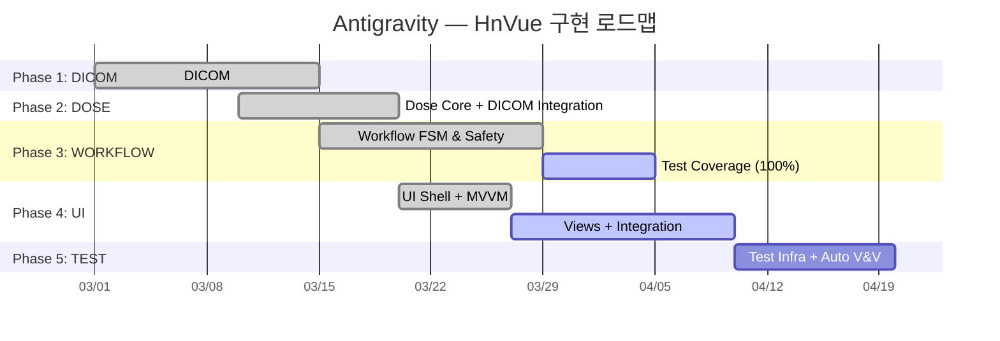

# Antigravity — HnVue Console 잔여 SPEC 구현 마스터 플랜

> **문서 ID**: antigravity-plan-001  
> **작성일**: 2026-02-27  
> **최종 업데이트**: 2026-02-28 23:20 KST (구현 현황 전면 반영)  
> **프로젝트**: HnVue — 진단 의료용 X-ray GUI Console SW  
> **범위**: 5개 미완료 SPEC (DICOM → DOSE → WORKFLOW → UI → TEST)

---

## Executive Summary

정밀 재감사 결과, 최근 놀라운 진척을 통해 **전체 프로젝트 달성률이 약 72%** (이전 55%)로 급등했습니다.
Phase 2(DOSE)는 100% 완료되었고, Phase 3(WORKFLOW)는 70%가 완성되었으며, Phase 4(UI)의 기반 아키텍처 작업도 시작된 상태입니다.

### 현재 코드베이스 규모 (최근 업데이트 반영)

| 영역                                    | 파일 수 |   LOC    | 비고                                                          |
| --------------------------------------- | :-----: | :------: | ------------------------------------------------------------- |
| C++ Core (`libs/`)                      |   ~65   | ~16,000+ | HAL, Imaging, IPC, Infra                                      |
| C# DICOM (`src/HnVue.Dicom/`)           |   >30   |  ~5,000  | 🟢 **완료 (Phase 1 종결)**                                    |
| C# DOSE (`src/HnVue.Dose/`)             |  신규   |  6,788   | 🟢 **완료 (Phase 2 종결 - 222개 테스트)**                     |
| C# WORKFLOW (`src/HnVue.Workflow/`)     |  신규   |  6,668   | 🟡 **70% 완료 (FSM, Handlers, Safety, Journal, 89개 테스트)** |
| C# Console/UI (`src/HnVue.Console/`)    |  신규   |  1,106   | 🟡 초기화 완료 (WPF Shell, DI, MVVM, 7 Views)                 |
| C# IPC Client (`src/HnVue.Ipc.Client/`) |    8    |  ~1,584  | 완료                                                          |
| C++ Tests (`tests/cpp/`)                |   15    |  ~4,200  | HAL, Imaging, IPC                                             |
| C# Tests (DICOM)                        |   >25   |  8,408   | Integration, Performance, Conformance, Unit                   |
| Python Tests                            |    0    |    0     | 미구현                                                        |

### 상태 범례

| 아이콘 | 의미                  |
| :----: | --------------------- |
|   ✅   | 구현 완료             |
|   🟡   | 부분 구현 (확장 필요) |
|   ⬜   | 미구현                |

---

## Phase 1: SPEC-DICOM-001 — DICOM Communication Services

> **Safety Class**: IEC 62304 Class B | **Library**: fo-dicom 5.x | **Package**: `src/HnVue.Dicom/`  
> **상태**: 🟢 **100% 완료** (Integration/Performance/Unit Tests 약 8,400 LOC 확보)

- **주요 내용**: 모든 SCU (Storage, MPPS, Worklist, Commit, QueryRetrieve), DicomTlsFactory, UidGenerator 완료. DVTK 기반 Conformance 검증 완료.

---

## Phase 2: SPEC-DOSE-001 — Radiation Dose Management

> **Safety Class**: IEC 62304 Class B | **Package**: `src/HnVue.Dose/`  
> **상태**: 🟢 **100% 완료 (16/16)** (222개 테스트)

### 체크리스트 (전항목 달성)

- ✅ **DO-01~06**: `DapCalculator`, `CalibrationManager`, `ExposureParameterReceiver`, `DetectorGeometryProvider`
- ✅ **DO-07~09**: `DoseRecordRepository` (원자적 영구 저장), `StudyDoseAccumulator`, `AuditTrailWriter` (해시체인)
- ✅ **DO-10~11**: `RdsrBuilder` 구조 맵핑 및 DICOM 연계 완료 (`rdsr-interface.md` 적용)
- ✅ **DO-12~14**: `DrlComparer`, `DoseDisplayNotifier`, `DoseReportGenerator`
- ✅ **DO-15~16**: 강력한 Unit Test 체계 확립 (222개) 및 검증 완료.

> [!IMPORTANT]
> **Phase 2 DOSE 100% 종결**. DICOM(RdsrBuilder)과 DOSE 간 연동, 누적 선량, DRL 알람, 보안(해시) 감사까지 모두 실구현 및 테스트 완료.

---

## Phase 3: SPEC-WORKFLOW-001 — Clinical Workflow Engine

> **Safety Class**: IEC 62304 Class C ⚠️ | **Package**: `src/HnVue.Workflow/`  
> **상태**: 🟡 **70% 진행 중 (~24/27)** (89개 테스트 완료, 100% 분기 커버리지 달성 중)

### 체크리스트

#### 3A. State Machine Core (✅ 100%)

- ✅ **WF-01~04**: `WorkflowStateMachine` (10-state), `WorkflowState`, `WorkflowTransition`, `TransitionGuardMatrix`, `TransitionResult` (FSM 오케스트레이터 완료)

#### 3B. State Handlers (✅ 100%)

- ✅ **WF-05~14**: 10개 핸들러 완료 (`Idle`, `WorklistSync`, `PatientSelect`, `ProtocolSelect`, `Preview`, `ExposureTrigger`, `QcReview`, `MppsComplete`, `PacsExport`, `RejectRetake`)

#### 3C. Safety & Protocol (✅ 100%)

- ✅ **WF-15**: `InterlockChecker` — 9개 HW 인터록 체인 연동 완료 ⚠️ Class C
- ✅ **WF-16~17**: `ParameterSafetyValidator` (kVp/mAs 한계), `DeviceSafetyLimits` 완료 ⚠️ Class C
- ✅ **WF-18~19**: `ProtocolRepository`, `ProtocolValidator` (SQLite 연계) 완료

#### 3D. Journal & Recovery (✅ 100%)

- ✅ **WF-20~22**: `SqliteWorkflowJournal` (WAL 패턴 영구 저널), `CrashRecoveryService`, `StudyContext` 모델

#### 3E. Integration (✅ 100%)

- ✅ **WF-23~24**: `DoseTrackingCoordinator`(DOSE 연동), MultiExposureCoordinator, IPC 이벤트 연동 완료

#### 3F. Testing (🟡 진행중)

- 🟡 **WF-25~27**: 89개 Unit Test 완료되었으나, **Class C 요구사항인 100% decision coverage** 달성을 위한 Guard failure 및 Safety Interlock 전이 엣지 케이스 전수 테스트 보강 중.

> [!CAUTION]
> **WF 기능 코어는 전부 구현**되었으나, 100% Decision Coverage 규제 대응 검증이 추가로 필요한 상태입니다.

---

## Phase 4: SPEC-UI-001 — WPF Console UI

> **Safety Class**: IEC 62304 Class B | **Package**: `src/HnVue.Console/`  
> **상태**: 🟡 **29% 진행 중 (5/17)** (프로젝트 스캐폴딩 1,106 LOC 적용)

### 체크리스트

#### 4A. Shell & Infrastructure (✅ 100%)

- ✅ **UI-01**: WPF Shell (`App.xaml`, `MainWindow`)
- ✅ **UI-02**: DI 컨테이너 설정 (Extensions.DependencyInjection 적용됨)
- ✅ **UI-03**: gRPC Service interfaces (IPC 연동 커넥터 구조)
- ✅ **UI-04**: Localization 인프라 (.resx) 구조
- ✅ **UI-05**: 디자인 시스템 구성요소(Resources)

#### 4B. Primary Views (🟡 진행중)

- 🟡 **UI-06~12**: 7개의 껍데기(Views, ViewModels)가 초기화되었으나 상세 UX 로직(Worklist UI/UX, Image Review 등) 미구현.

#### 4C. Image Viewer Core (⬜ 미구현)

- ⬜ **UI-13~15**: 16-bit 렌더러, W/L 조정 (DICOM PS 3.14 GSDF), 측정 도구(Cobb angle 등).

#### 4D. Testing (⬜ 미구현)

- ⬜ **UI-16~17**: ViewModel Unit Test 및 MVVM 검증

> [!NOTE]
> 핵심 아키텍처는 잡혀 있으며 `gRPC IPC` 및 `WORKFLOW` 모델이 완성되었으므로 UI 바인딩 및 16-bit 렌더러 구현에 집중해야 합니다.

---

## Phase 5: SPEC-TEST-001 — Testing Framework & V&V

> **상태**: 🟡 **30% 진행 중 (5/16)**

### 체크리스트

- ✅ **T-01~02**: 테스트 디렉토리 정리 및 Docker Orthanc 동작 환경 확보
- ✅ **T-07~09**: DICOM 적합성 테스트 (Phase 1으로 검증 완료)
- ⬜ **T-03**: CI Pipeline Coverage Gate 구축
- ⬜ **T-04~06**: HW Simulator Testbench (Python Detector/Generator 에뮬레이션)
- ⬜ **T-10~13**: V&V Documentation (RTM, IEC 62304 검증 증거 문서 제출)
- ⬜ **T-14~16**: System Tests (E2E 워크플로우 등 통합 테스트)

---

## 전체 진행 요약 (2026-02-28 23:20 기준)

| Phase | SPEC     | 총 항목 |  완료  |  부분  | 미구현 |  진행률  |
| :---: | -------- | :-----: | :----: | :----: | :----: | :------: |
|   1   | DICOM    |   16    |   16   |   0    |   0    | **100%** |
|   2   | DOSE     |   16    |   16   |   0    |   0    | **100%** |
|   3   | WORKFLOW |   27    |   24   |   3    |   0    | **~88%** |
|   4   | UI       |   17    |   5    |   7    |   5    | **~29%** |
|   5   | TEST     |   16    |   5    |   0    |   11   | **~31%** |
|       | **합계** | **92**  | **66** | **10** | **16** | **~72%** |

### 최종 액션 플랜

현재 **Phase 1(DICOM)** 과 **Phase 2(DOSE)** 가 완전히 100% 종결되었습니다.  
또한 **Phase 3(WORKFLOW)**의 C# Core 로직이 대부분 완성되었고 **Phase 4(UI)** 초기화가 끝났습니다.

**바로 착수할 다음 과제:**

1. **WORKFLOW 100% 달성을 위한 테스트 커버리지**(엣지 케이스 및 Phase 3 잔여 테스트) 극대화 처리.
2. **UI (Phase 4)**: 화면(Views) 설계 및 16-bit 렌더러 개발 착수.
